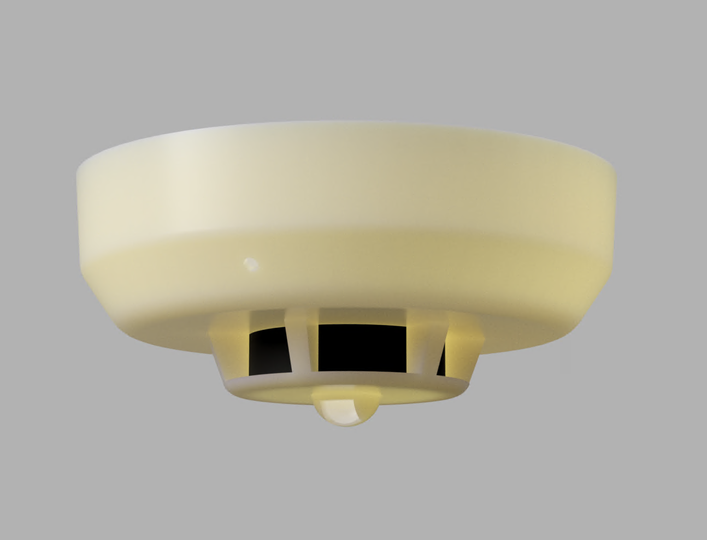

# Firebeetle2 email security cam (ESP-32)

PIR activated wifi security cam. Emails four burst images and deepsleeps. Uses BJT transistor to power up/down SPI Arducam OV2460. Built for very long battery life (up to 1 year on a 6000mh 4.2v liPo). 

Circuit diagram coming soon. 3-d printable magnet-mounted smoke detector housing coming soon. 